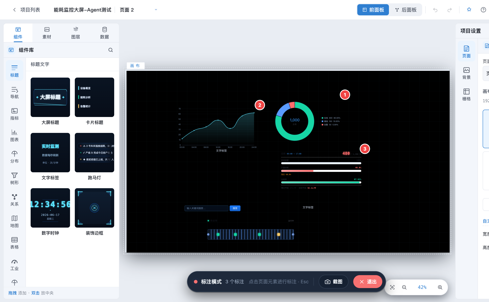
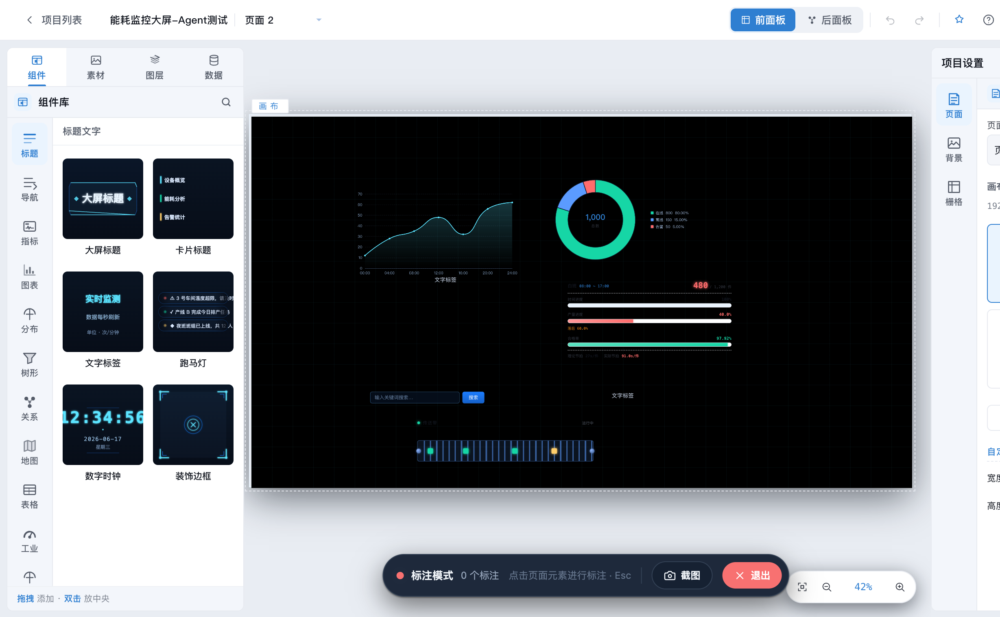
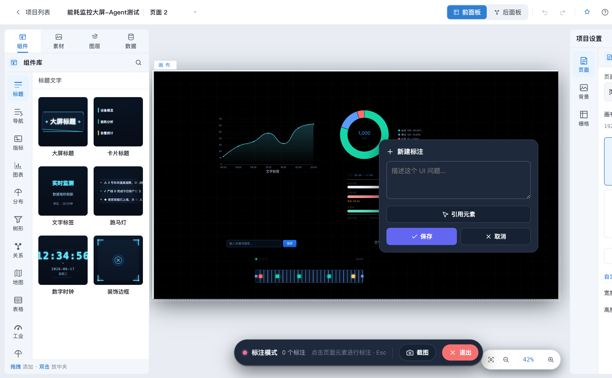
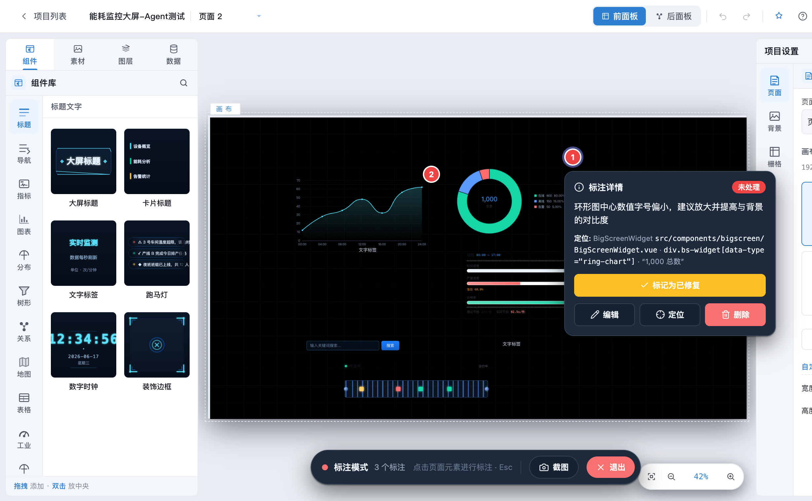
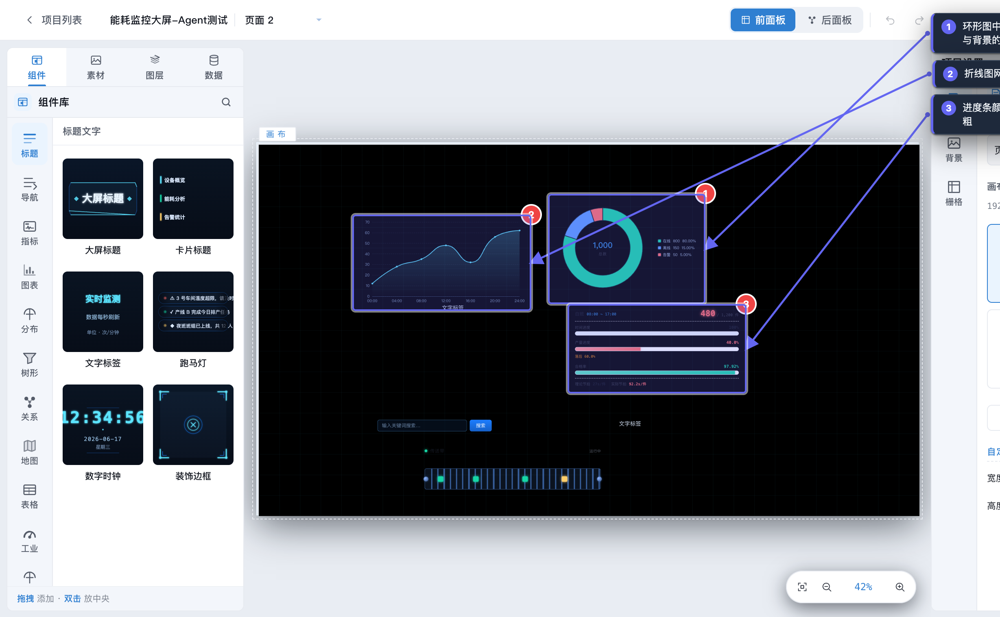
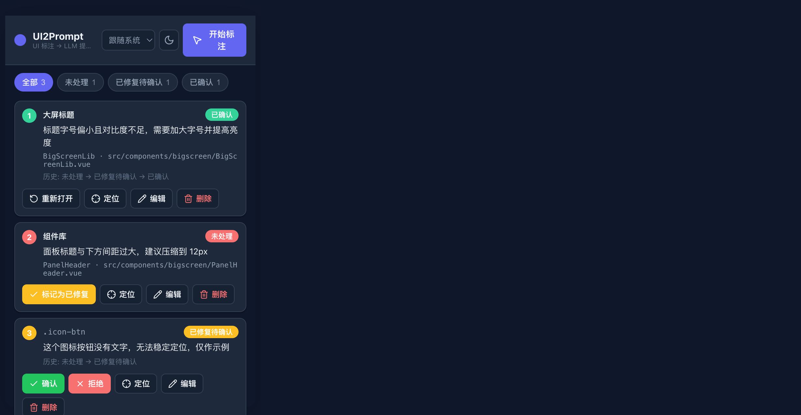
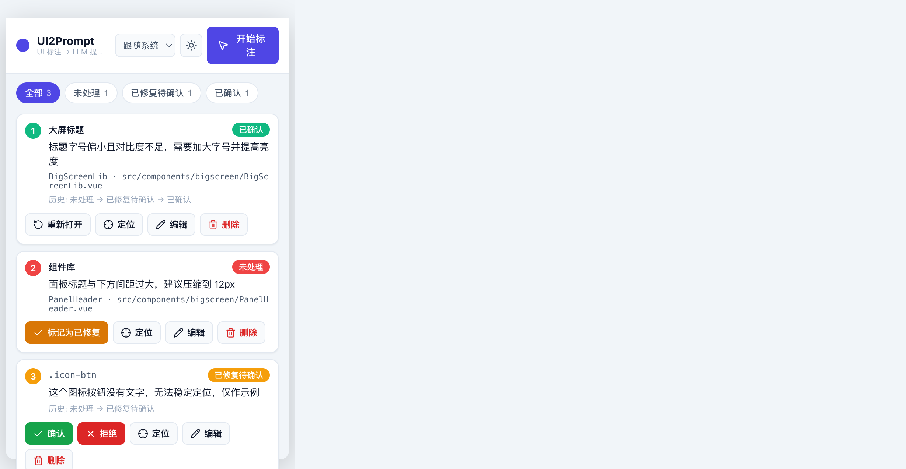
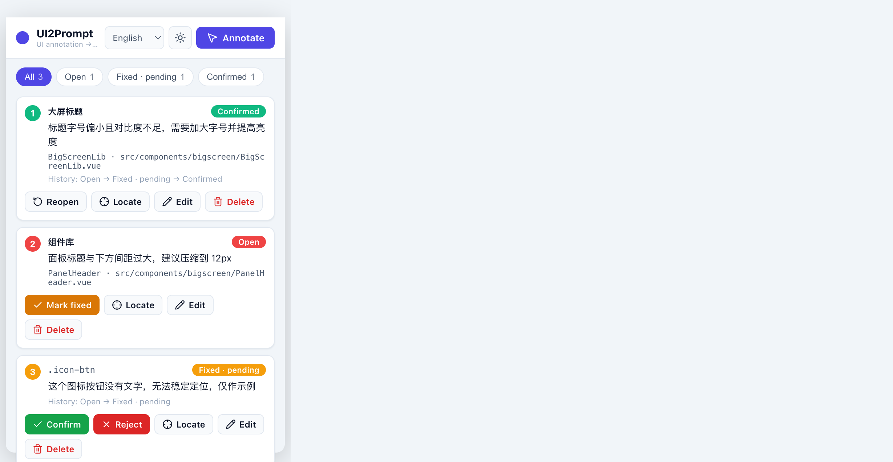

<div align="center">

# UI2Prompt

**在浏览器里标注 UI 问题 → 一键生成可直接粘贴给 AI 编程助手的精准提示词。**

一个 Manifest V3 Chrome 扩展，把「这个按钮看着不对」变成结构化、定位清晰的任务描述，交给 Cursor / Claude Code / Copilot —— 让 AI 明确知道问题**在哪里**、要**改什么**。

[English](./README.md) · 简体中文



</div>

---

## 为什么需要它

直接对 AI 说「修一下仪表盘的间距」往往没用 —— 它看不到你的屏幕，只能猜文件，且经常猜错。UI2Prompt 把这个闭环补上：

1. **指**：在真实页面上点选出问题元素。
2. **说**：用一句话描述问题。
3. **导出**：生成一份精简提示词，把每个问题钉死到 Vue 组件 / 源文件、稳定的 CSS 选择器，并附带（兜底用的）带箭头标注截图。

每一条的输出只有两个目标：**能定位** + **说清问题**，不掺杂任何干扰信息。

## 功能

| 模块 | 能力 |
| --- | --- |
| **标注模式** | hover 高亮任意元素，click 落下编号 marker 并填写问题。标注期间**屏蔽原页面快捷键**，输入时不会误触宿主应用。 |
| **智能定位** | 选择器优先级：`id` → 语义化 `data-*`（如 `data-type`）→ `name`/`aria-label`/`title` → 有意义的 class。每个选择器都会校验**仅匹配唯一元素**；不稳定的位置型选择器被标记为 `weak` 并**从提示词中剔除**，避免误导 AI。 |
| **Vue 源码映射** | 识别 Vue 组件名、完整组件路径，以及真实源文件（`__file`，如 `src/components/.../Widget.vue`）—— 这是最强的「定位」。同时识别 React 组件名。 |
| **悬浮工具栏** | 屏幕中下方的状态胶囊显示模式与标注数量，带**截图**与**退出**按钮。`⌘/Ctrl + M` 切换，`Esc` 退出。 |
| **引用元素** | 写描述时点击**引用元素**，可再点选任意元素，把它的语义路径（优先 Vue 路径）插入到描述中。 |
| **修复验证流转** | `未处理 → 已修复待确认 → 已确认 / 拒绝`，并记录完整历史。修复后 marker 通过 `selector → xpath → 坐标` 重新绑定；拒绝会带上原因并重新打开该问题。 |
| **标注截图** | 退出时把每个标注用箭头连到对应元素并配编号图例，再整页截图 —— 当选择器无法解析时，这张图就是自洽的兜底依据。 |
| **精简提示词导出** | 页面**标题 + URL**，随后每个问题一行：状态、描述、最佳定位。默认 Markdown，可选结构化 JSON。支持复制或**下载**为文件。 |
| **精致界面** | 明亮 / 深色 / 跟随系统主题，多语言（English、简体中文、繁體中文、日本語、한국어），全程高质量内联 SVG 图标。 |
| **持久化** | 按 URL 分页存储，刷新不丢失（扩展用 `chrome.storage.local`，注入/页面态回退 IndexedDB）。自动跟踪 SPA 路由变化。 |

## 截图

| 悬浮工具栏（标注模式） | 页面 marker |
| --- | --- |
|  |  |

| 新建标注 + 引用元素 | 详情与状态流转 |
| --- | --- |
|  |  |

| 标注截图（AI 兜底） | Popup —— 深色 |
| --- | --- |
|  |  |

<details>
<summary>更多主题与语言</summary>

| 明亮 | English |
| --- | --- |
|  |  |

</details>

## 安装

### 从 Release 安装（推荐）

1. 在 [Releases](../../releases) 页面下载 `ui2prompt-dist.zip` 并解压。
2. 打开 `chrome://extensions`，开启右上角「开发者模式」。
3. 点击「加载已解压的扩展程序」，选择解压出的 `dist/` 目录。

### 从源码构建

```bash
npm install
npm run build      # 产物输出到 dist/
```

随后按上面的方式「加载已解压的扩展程序」选择 `dist/`。

## 使用

1. 点击工具栏图标 → **开始标注**，或按 `⌘/Ctrl + M`（或 `Alt+Shift+A`）。鼠标变十字，悬浮工具栏出现。
2. hover 高亮元素，点击它并描述问题。可点击**引用元素**插入其它元素的路径。保存后出现编号 marker。
3. 点击 marker 查看详情：改状态、编辑、定位、删除。
4. AI 修复后刷新页面 —— marker 自动重新绑定；若元素已不存在则降级到坐标并标记提示。
5. 对于「已修复待确认」的问题，点击**确认**或**拒绝**（填写原因）完成闭环。
6. 在 Popup 底部点击**复制提示词** / **复制全部** / **下载**，把结构化提示词交给 AI。按 `Esc`（或工具栏**退出**）离开标注模式 —— 会自动截一张带箭头的标注图作为兜底。

### 快捷键

| 快捷键 | 作用 |
| --- | --- |
| `⌘/Ctrl + M` | 切换标注模式 |
| `Alt + Shift + A` | 切换标注模式（全局命令） |
| `Esc` | 关闭当前弹层，或退出标注模式 |

标注模式激活时，会屏蔽宿主页面自身的快捷键。

## 架构

```
src/
├── shared/        # 与运行环境无关的核心
│   ├── constants.js  annotation.js  id.js
│   ├── db.js  backends.js  store.js      # IndexedDB + chrome.storage 双后端
│   ├── router.js                         # 消息路由（background 与 harness 复用）
│   ├── prompt.js                         # 精简提示词生成
│   ├── i18n.js  locales/                 # en / zh-CN / zh-TW / ja / ko
│   ├── settings.js  theme.js  icons.js   # 主题/语言偏好、设计 token、SVG
├── background/    # Service worker：单一数据源、角标、截图+下载
├── content/       # 页面态引擎
│   ├── index.js          # 编排：消息、SPA 路由、快捷键、设置
│   ├── annotator.js      # 标注模式、屏蔽快捷键、引用元素选择
│   ├── capture.js  locator.js            # 选择器/XPath/bbox + 质量分级
│   ├── vue-detect.js  framework-bridge.js  main-world.js  # 跨 world 框架识别
│   └── overlay/          # overlay.js / marker.js / editor.js / toolbar.js / snapshot.js
└── popup/         # 管理界面（html/css/js + api.js + render.js）
```

要点：

- **双 world 内容脚本**：`ISOLATED` world 负责 UI、存储与消息；`MAIN` world 读取隔离 world 不可见的框架内部属性（`__vueParentComponent`、`__file`），二者通过 `postMessage` 桥接。
- **单一数据源**：background 持有 `chrome.storage.local`，content / popup 通过消息读写；注入页面态自动回退 IndexedDB，引擎可独立测试。
- **高性能 overlay**：`requestAnimationFrame` 批量更新 marker 位置，`MutationObserver` 在 DOM 变化时重绑，Shadow DOM 隔离样式且不阻塞页面交互。

## 开发

```bash
npm run build      # 构建扩展到 dist/
npm run watch      # 监听源码增量构建
npm run harness    # 构建 dist/popup-dev.html，可在普通标签页预览 Popup UI
```

`harness` 通过 `chrome.*` shim + 真实 store/router 驱动，仅用于本地预览，不会包含在扩展产物中。

## 不足之处

- **无法访问 iframe 内容**：仅支持顶层框架元素（`all_frames: false`）。
- **`<canvas>`/WebGL 内部不可见**（图表、地图）：定位会落到最近的语义包裹元素，标注截图作为视觉兜底。
- **选择器稳定性取决于应用本身**：当元素没有 `id`、语义属性或有意义的 class 时，选择器会被判为 `weak` 并刻意不放进提示词，此时请依赖 Vue 源码映射与截图。
- **源文件映射依赖开发态元数据**：`__file` 存在于 Vue 开发构建中；生产构建若被剥离，则回退到组件名。
- **单倍像素截图**：使用 `captureVisibleTab`，即当前缩放下的当前视口。

## 贡献

欢迎提交 Issue 和 PR。请保持模块小而内聚、优先根因修复，并在提交前运行 `npm run build`（无 lint 报错）。

## 许可证

[MIT](./LICENSE) © UI2Prompt contributors。
