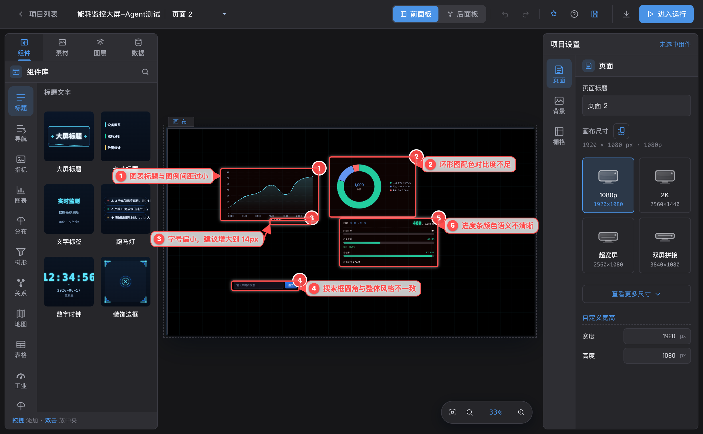
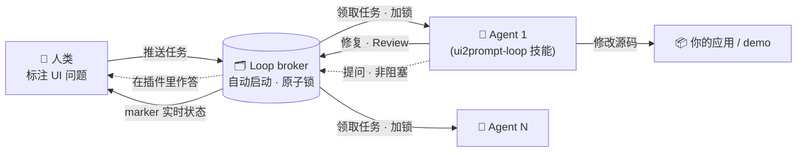
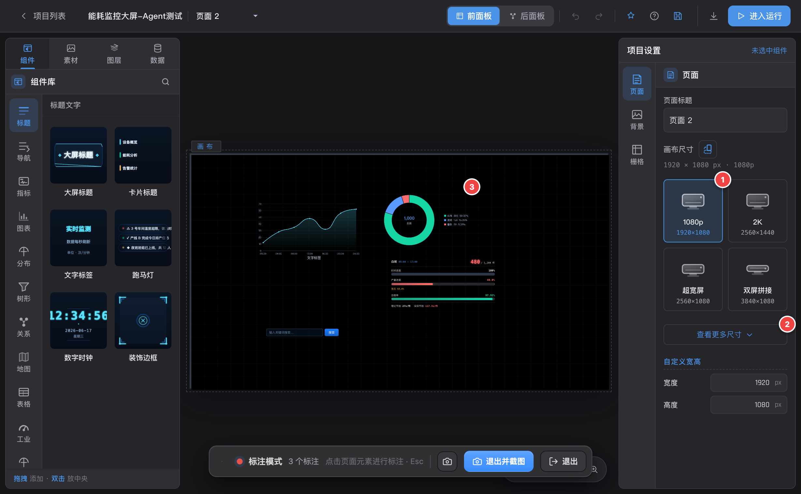
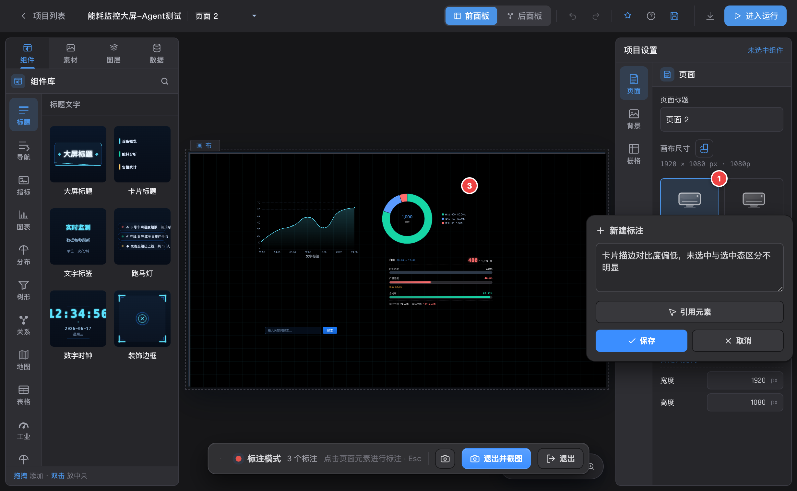
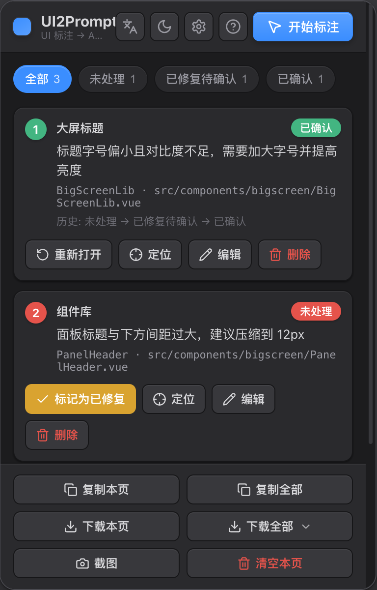
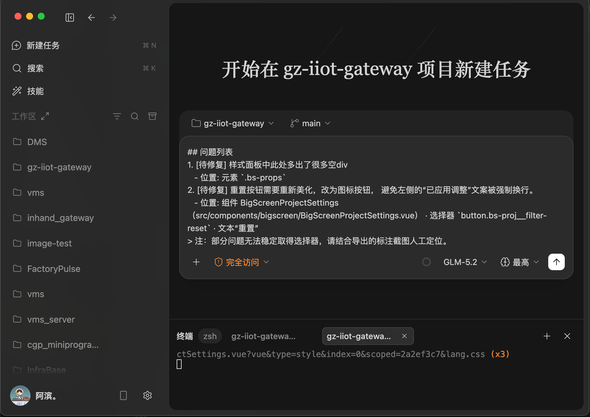
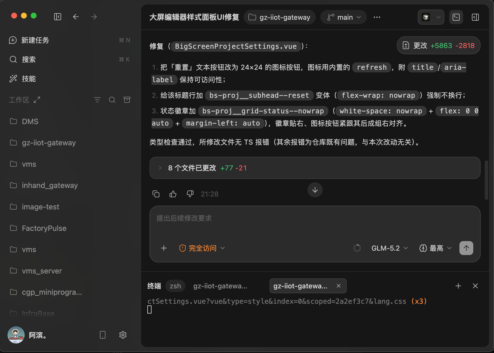
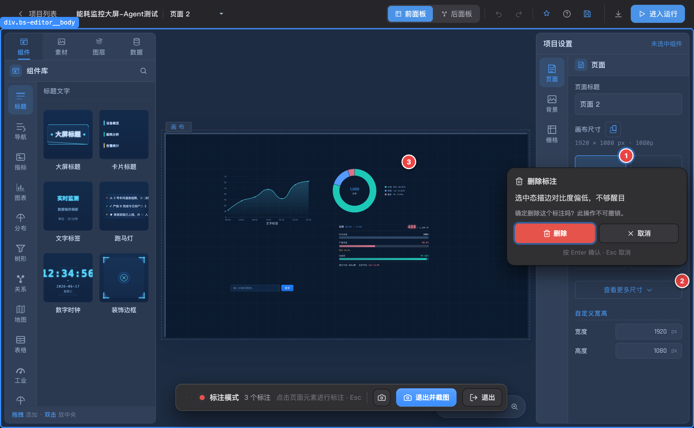
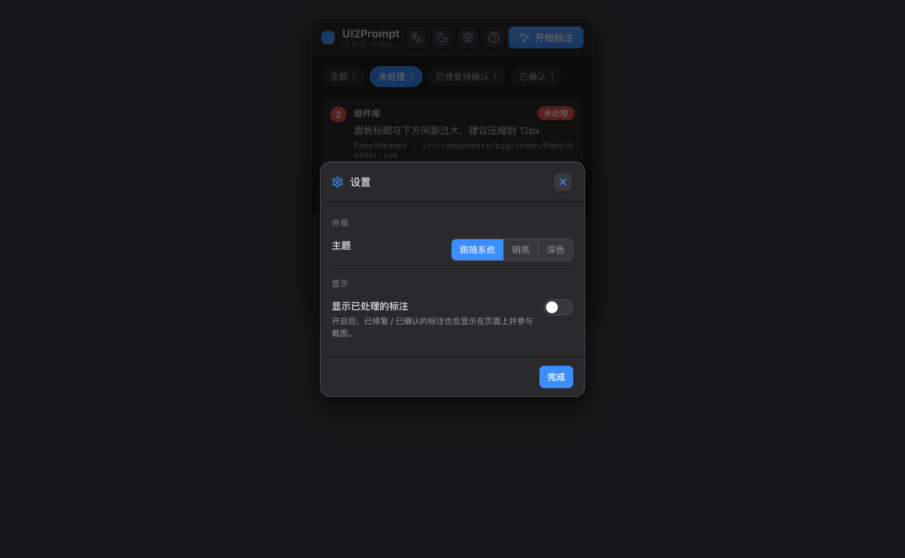

<div align="center">

# UI2Prompt

**在浏览器里标注 UI 问题，导出一份可直接交给编码 Agent 的精准提示词。**

一个 Manifest V3 Chrome 扩展，把「这个按钮看着不对」变成结构化、定位清晰的任务描述，交给 Cursor / Claude Code / Copilot —— 让 Agent 明确知道问题**在哪里**、要**改什么**。

[English](./README.md) · 简体中文



</div>

---

## ✨ 亮点：Loop 循环模式 —— 人类标注，Agent 持续修复

**Loop 模式**把 UI2Prompt 从「一次性导出提示词」升级为「持续协作的修复流水线」。你只管在浏览器里不断标注 UI 问题；一个或多个编码 Agent（Claude Code、Cursor……）会持续地 **领取 → 修复 → 自查 Review** 每一个问题，并把进度实时回写到页面上 —— 当一个问题存在多种合理解法时，Agent 会**带选项向你提问**，你直接在插件里点选作答，而且**全程不阻塞**它处理其他任务。

一个零依赖的本地 **broker（任务中枢）** 是扩展与 Agent 之间的共享数据源。它保证每个任务同一时刻只交给**一个** Agent（原子锁），因此你可以**多 Agent 并发**而互不抢占。Agent 通过一个**技能（skill）**来驱动它，技能会自动帮你启动 broker —— 无需配置 MCP，也不用盯着任何服务。



Agent 不会自行停止：队列为空时等待约 60 秒再轮询，持续循环直到你结束会话。marker 会实时流转 **进行中 → AI 已修复 → AI 已 Review**，最后你用**确认 / 拒绝**收尾。

### 两步安装

1. **安装浏览器扩展**（见下方 [安装](#安装)）。
2. **给你的编码 Agent 安装 loop 技能** —— 一行命令，Claude Code 和 Cursor 通用：
   ```bash
   curl -fsSL https://github.com/cocbin/MarkUI2Prompt/releases/latest/download/install.sh | bash
   ```
   <sub>从源码安装则用：`npm run install-skill`。</sub>

就这么多。接着开始使用：

1. 在插件里点击 **↻ Loop** 按钮，打开**启用 Loop 模式**，并**复制 Agent 提示词**。
2. 把提示词粘贴进你的 Agent（Claude Code、Cursor……）让它运行。技能会**自动启动本地 broker**，Agent 随即开始领取并修复 —— 想要更高吞吐，随时在另一个终端再开一个 Agent。
3. 像平常一样标注问题。看着 Agent 实时修复、在插件里回答它的选择题、并**确认**结果。

> **用 demo 试一下：** `npm run demo` 会在 <http://localhost:5179> 启动一个故意写了 bug 的多 Tab 设置页。标注它的问题、把提示词粘贴给 Agent，看着问题被修好。本 Loop 已用真实的 Claude Code Agent 端到端验证：5 个预埋 bug 全部被修复并标记为 **AI 已 Review**。

<details>
<summary>更喜欢用 MCP？（可选）</summary>

仓库同样提供 MCP 服务（`server/mcp.mjs`），把相同的操作暴露为原生工具。让 Agent 指向 `.mcp.json`（例如 `claude --mcp-config .mcp.json`），并用 `npm run broker` 启动 broker。上面的技能方式是推荐路径，因为它不需要任何 MCP 配置，并会自行启动 broker。
</details>

## 为什么需要它

直接对 Agent 说「修一下仪表盘的间距」往往没用 —— 它看不到你的屏幕，只能猜文件，且经常猜错。UI2Prompt 把这个闭环补上：

1. **指**：在真实页面上点选出问题元素。
2. **说**：用一句话描述问题。
3. **导出**：生成一份精简提示词，把每个问题钉死到 Vue 组件 / 源文件、稳定的 CSS 选择器，并附带（兜底用的）带箭头标注截图。

每一条的输出只有两个目标：**能定位** + **说清问题**，不掺杂任何干扰信息。

## 功能

| 模块 | 能力 |
| --- | --- |
| **🔁 Loop 循环模式** | 人类标注，一个或多个编码 Agent 通过本地 broker（MCP 或 HTTP）持续 领取 → 修复 → 自查 Review。带选项的提问在插件里非阻塞作答；多 Agent 并发由原子任务锁保证不抢占。详见 [Loop 模式](#-亮点loop-循环模式--人类标注agent-持续修复)。 |
| **Tab 感知 marker** | marker 会记住自己是在哪个对话框 / Tab 下创建的。切到别的 Tab 时它会自动隐藏，而不是停留在错误位置；**定位**会先自动切回标注时所在的 Tab。 |
| **标注模式** | hover 高亮任意元素，click 落下编号 marker 并填写问题。标注期间**屏蔽原页面快捷键**，输入时不会误触宿主应用。 |
| **智能定位** | 选择器优先级：`id` → 语义化 `data-*`（如 `data-type`）→ `name`/`aria-label`/`title` → 有意义的 class。每个选择器都会校验**仅匹配唯一元素**；不稳定的位置型选择器被判为 `weak` 并**从提示词中剔除**，避免误导 Agent。 |
| **Vue 源码映射** | 识别 Vue 组件名、完整组件路径，以及真实源文件（`__file`，如 `src/components/.../Widget.vue`）—— 这是最强的「定位」。同时识别 React 组件名。 |
| **可拖动工具栏** | 悬浮状态栏显示模式与标注数量，带**截图**、**退出并截图**、**退出**。当它挡住要标注的内容时，可通过左侧手柄拖动。`⌘/Ctrl + M` 切换模式，`Esc` 退出。 |
| **引用元素** | 写描述时点击**引用元素**，可再点选任意元素，把它的语义路径（优先 Vue 路径）插入到描述中。 |
| **修复验证流转** | `未处理 → 已修复待确认 → 已确认 / 重开`，并记录完整历史。修复后 marker 通过 `selector → xpath → 坐标` 重新绑定；拒绝会带上原因并重新打开该问题。 |
| **聚焦视图** | 已处理的标注（已修复 / 已确认）默认从页面与截图中隐藏，面板默认停留在**未处理** Tab —— 让你只看到还需处理的内容。可在**设置**中开关。 |
| **标注截图** | 每个标注用红色箭头连到对应元素，并配半透明编号标签，既醒目又不遮挡原界面。可从工具栏、**退出并截图**或面板触发 —— 当选择器无法解析时，这张图就是自洽的兜底依据。 |
| **本地化提示词导出** | 页面**标题 + URL**，随后每个问题一行：状态、描述、最佳定位。可复制或下载**当前页**或**全部页面**（合并为一个文件，或按页拆分为多个文件）。导出文案跟随所选语言。 |
| **内置使用说明** | 面板中的 **?** 按钮里有一份图文向导，从进入标注模式到把提示词交给 Agent，一步步带你走完整流程。 |
| **精致界面** | 类编辑器的分层中性配色，支持明亮 / 深色 / 跟随系统，五种界面语言（English、简体中文、繁體中文、日本語、한국어），全程高质量内联 SVG 图标。 |
| **持久化** | 按 URL 分页存储，刷新不丢失（扩展用 `chrome.storage.local`，注入/页面态回退 IndexedDB）。自动跟踪 SPA 路由变化。 |

## 使用走查

从发现 UI 问题，到看着 Agent 把它修好，一共六步。面板里的 **?** 按钮内置了同一份图文向导。

### 1 · 进入标注模式

点击右上角「开始标注」，或使用快捷键 `⌘/Ctrl + M`。页面底部会出现标注工具栏。



### 2 · 点选元素并描述问题

鼠标悬停高亮元素，点击后在弹出框中描述 UI 问题；可用「引用元素」插入另一个元素的选择器。



### 3 · 管理标注与状态

在插件面板查看标注列表，按「未处理 → 已修复待确认 → 已确认」流转状态，并可定位、编辑或删除。



### 4 · 截图与导出提示词

点击「截图」生成带箭头的标注图作为兜底；再用「复制本页」或「下载」导出 Agent 提示词。


### 5 · 发送给 Agent

把导出的提示词（必要时连同截图）粘贴给编码 Agent，例如 **Claude Opus 4.8 1M Max**。



### 6 · Agent 自动修复

Agent 依据提示词定位源码并完成修复，你可回到页面用「确认 / 拒绝」验证结果。



<div align="center">

| 删除二次确认 | 设置 |
| --- | --- |
|  |  |

</div>

## 安装

### 从 Release 安装（推荐）

1. 在 [Releases](../../releases) 页面下载 `ui2prompt-dist.zip` 并解压。
2. 打开 `chrome://extensions`，开启右上角「开发者模式」。
3. 点击「加载已解压的扩展程序」，选择解压出的 `dist/` 目录。

### 从源码构建

```bash
npm install
npm run build      # 产物输出到 dist/
```

随后按上面的方式「加载已解压的扩展程序」选择 `dist/`。

### Loop 技能（用于 loop 模式）

给 Agent 安装一次技能（Claude Code + Cursor），之后 broker 会按需自动启动：

```bash
curl -fsSL https://github.com/cocbin/MarkUI2Prompt/releases/latest/download/install.sh | bash
# 或从源码：npm run install-skill
```

## 使用

1. 点击工具栏图标 → **开始标注**，或按 `⌘/Ctrl + M`（或 `Alt + Shift + A`）。鼠标变十字，悬浮工具栏出现。
2. hover 高亮元素，点击它并描述问题。可点击**引用元素**插入其它元素的路径。保存后出现编号 marker。
3. 点击 marker 查看详情：改状态、编辑、定位、删除。选中 marker 后按 `Delete` 可快速删除（二次确认，`Enter` 确认）。
4. Agent 修复后刷新页面 —— marker 自动重新绑定；若元素已不存在则降级到坐标并标记提示。
5. 对于「已修复待确认」的问题，点击**确认**或**拒绝**（填写原因）完成闭环。
6. 在面板底部使用**复制** / **下载**（当前页或全部页面），用**截图**生成带箭头的标注图。导出文案会跟随所选语言。按 `Esc`（或工具栏**退出**）离开标注模式 —— 退出不再自动截图，需要截图时请用**退出并截图**。

第一次用？打开面板点击 **?** 按钮，里面有图文向导。

### 快捷键

| 快捷键 | 作用 |
| --- | --- |
| `⌘/Ctrl + M` | 切换标注模式 |
| `Alt + Shift + A` | 切换标注模式（全局命令） |
| `Delete` / `Backspace` | 删除选中的标注（二次确认） |
| `Enter` | 确认删除提示 |
| `Esc` | 关闭当前弹层，或退出标注模式 |

标注模式激活时，会屏蔽宿主页面自身的快捷键。

## 项目是怎么做出来的

UI2Prompt 由一份结构化提示词完整描述并实现 —— 见 [`docs/ui-annotation-plugin-prompt.md`](./docs/ui-annotation-plugin-prompt.md) —— 全程由 **Claude Opus 4.8 1M Max** 编码 Agent 端到端完成。这份文档本身也值得一读：它正是本扩展想帮你产出的那种「精准、范围清晰」提示词的范例。

## 架构

```
src/
├── shared/        # 与运行环境无关的核心
│   ├── constants.js  annotation.js  id.js
│   ├── db.js  backends.js  store.js      # IndexedDB + chrome.storage 双后端
│   ├── router.js                         # 消息路由（background 与 harness 复用）
│   ├── prompt.js  loop.js                # 本地化提示词 + Loop 任务/提示词构建
│   ├── i18n.js  locales/                 # en / zh-CN / zh-TW / ja / ko
│   ├── settings.js  theme.js  icons.js   # 主题/语言偏好、设计 token、SVG
├── background/    # Service worker：单一数据源、角标、截图+下载、Loop 桥接
├── content/       # 页面态引擎
│   ├── index.js          # 编排：消息、SPA 路由、快捷键、设置、Loop 轮询
│   ├── annotator.js      # 标注模式、屏蔽快捷键、引用元素选择
│   ├── capture.js  locator.js            # 选择器/XPath/bbox + 质量分级
│   ├── ui-context.js  tab-path.js  dom-model.js  # 对话框/Tab 上下文、跨 Tab 定位、4 层 DOM
│   ├── vue-detect.js  framework-bridge.js  main-world.js  # 跨 world 框架识别
│   └── overlay/          # overlay.js / marker.js / editor.js / toolbar.js / snapshot.js
├── popup/         # 管理界面（html/css/js + api.js + render.js + menus.js + dialogs.js + loop-panel.js）
server/            # Loop broker（本地运行，不属于扩展产物）
├── broker.mjs     # 零依赖 HTTP 任务中枢：队列、原子锁、提问、持久化
├── store.mjs      # 内存态任务/问题存储 + JSON 持久化
└── mcp.mjs        # 可选的 stdio MCP 服务，为编码 Agent 代理 broker
skills/ui2prompt-loop/   # 可安装的 Agent 技能（用户安装的就是它）
├── SKILL.md       # Agent 遵循的 loop 协议
├── loop.mjs       # 自包含 CLI：自动启动 broker，领取/修复/Review/提问/作答
└── broker.mjs     # 打包成单文件的零依赖 broker（由 server/*.mjs 构建）
demo/              # 故意写了 bug 的多 Tab demo（npm run demo）
```

要点：

- **双 world 内容脚本**：`ISOLATED` world 负责 UI、存储与消息；`MAIN` world 读取隔离 world 不可见的框架内部属性（`__vueParentComponent`、`__file`），二者通过 `postMessage` 桥接。
- **单一数据源**：background 持有 `chrome.storage.local`，content / popup 通过消息读写；注入页面态自动回退 IndexedDB，引擎可独立测试。
- **高性能 overlay**：`requestAnimationFrame` 批量更新 marker 位置，`MutationObserver` 在 DOM 变化时重绑，Shadow DOM 隔离样式且不阻塞页面交互。

## 开发

```bash
npm run build      # 构建扩展到 dist/
npm run watch      # 监听源码增量构建
npm run harness    # 构建 dist/popup-dev.html，可在普通标签页预览 Popup UI
npm run serve      # 静态托管 dist/ 于 http://localhost:5180（打开 /popup-dev.html）
npm run broker     # 启动 Loop 任务中枢，地址 http://127.0.0.1:8787（通常由技能自动拉起）
npm run mcp        # 运行可选的 stdio MCP 服务（仅在使用 .mcp.json 时需要）
npm run skill      # 把 broker 打包进 skills/ui2prompt-loop 并压缩到 dist-skill/
npm run install-skill  # 构建并把技能安装到 ~/.claude/skills 与 ~/.cursor/skills
npm run demo       # 启动 bug demo 应用，地址 http://localhost:5179
```

`harness` 通过 `chrome.*` shim + 真实 store/router 驱动，仅用于本地预览，不会包含在扩展产物中。`server/` 的 broker、`skills/` 技能包与 `demo/` 应用是 Loop 模式的本地工具，同样不会打包进扩展产物。

## 不足之处

- **无法访问 iframe 内容**：仅支持顶层框架元素（`all_frames: false`）。
- **`<canvas>`/WebGL 内部不可见**（图表、地图）：定位会落到最近的语义包裹元素，标注截图作为视觉兜底。
- **选择器稳定性取决于应用本身**：当元素没有 `id`、语义属性或有意义的 class 时，选择器会被判为 `weak` 并刻意不放进提示词，此时请依赖 Vue 源码映射与截图。
- **源文件映射依赖开发态元数据**：`__file` 存在于 Vue 开发构建中；生产构建若被剥离，则回退到组件名。
- **单倍像素截图**：使用 `captureVisibleTab`，即当前缩放下的当前视口。

## 贡献

欢迎提交 Issue 和 PR。请保持模块小而内聚、优先根因修复，并在提交前运行 `npm run build`（无 lint 报错）。

## 许可证

[MIT](./LICENSE) © UI2Prompt contributors。
